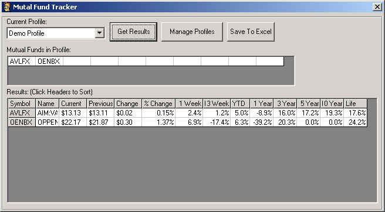



## Mutual Fund Tracker

### Description

This is just an update of the previous entry. The site where I was obtaining the data changed there format and I then had to find another site to get the data. The Mutual Fund Tracker allows you to track mutual fund performance and save the performance results to an excel spreadsheet. The Mutual Fund Tracker allows you store up to 10 mutual fund profiles/portfolios. Each profile can store any number of mutual fund symbols.
 
### More Info
 
The user must enter valid mutual fund symbols.

Needs access to the internet to get the performance results.

Returns the performance of the selected mutual funds and can save these performace results as an excel spreadsheet.

Writes to the registry. User would need read/write access to the registry.

             |
---                |---
**Submitted On**   |2001-03-16 11:20:10
**By**             |[David Bevan](https://github.com/Planet-Source-Code/PSCIndex/blob/master/ByAuthor/david-bevan.md)
**Level**          |Intermediate
**User Rating**    |4.7 (14 globes from 3 users)
**Compatibility**  |VB 5\.0, VB 6\.0, VBA MS Excel
**Category**       |[Complete Applications](https://github.com/Planet-Source-Code/PSCIndex/blob/master/ByCategory/complete-applications__1-27.md)
**World**          |[Visual Basic](https://github.com/Planet-Source-Code/PSCIndex/blob/master/ByWorld/visual-basic.md)
**Archive File**   |[CODE\_UPLOAD171373162001\.zip](https://github.com/Planet-Source-Code/david-bevan-mutual-fund-tracker__1-14716/archive/master.zip)

### API Declarations

API registry bas module. Did not create it found on the internet.

